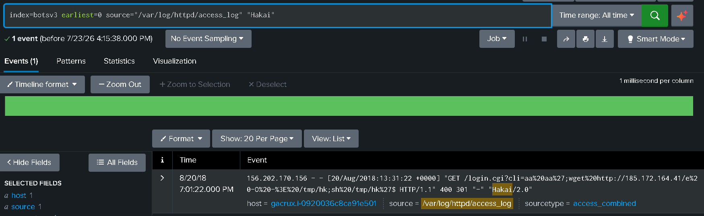
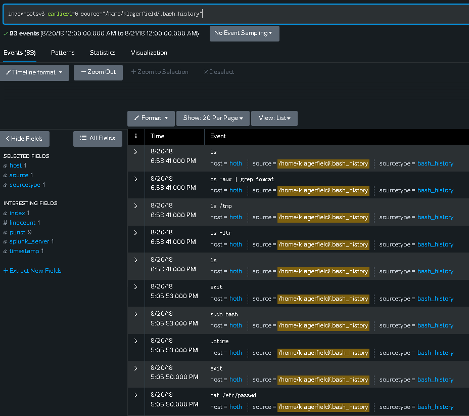
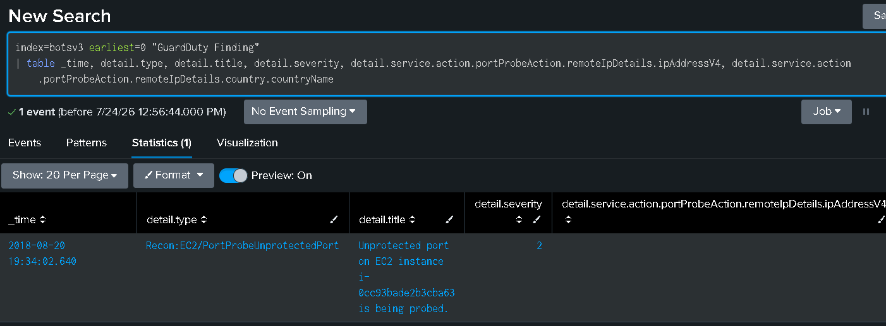
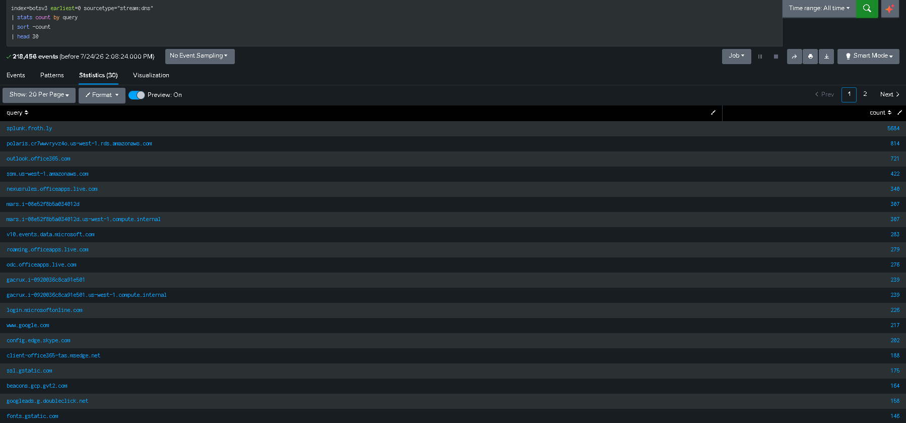

# SOC Alert Triage — Splunk BOTS v3 Dataset

## Overview
A large-scale alert triage exercise using Splunk's official BOTS v3 (Boss of the SOC) 
dataset — realistic security telemetry from a simulated company ("Frothly Inc.") across 
Linux, AWS, and Windows. Unlike a self-built lab, this exercise involved investigating 
unfamiliar, ambiguous data to practice real SOC L1 triage judgment.

## Findings
1. **IoT Botnet Command Injection (Hakai)** — True Positive, failed exploitation attempt
   
2. **klagerfield Bash History Review** — False Positive, correctly ruled out after full context review
   
3. **AWS GuardDuty Port Probe** — True Positive, reconnaissance against production infrastructure
   
4. **DNS Traffic Sweep** — Clean result, no indicators of compromise
   

Investigation also covered AWS CloudTrail account activity, Windows process execution 
events, and internal automated traffic patterns — all reviewed and correctly ruled out 
as benign, demonstrating triage judgment beyond the findings documented in detail above.

## Full Report
See [bots-triage-report.pdf](./bots-triage-report.pdf)

## Queries Used
See [splunk-queries.md](./splunk-queries.md)

## Skills Demonstrated
- Large-scale log triage across heterogeneous data sources (Linux, AWS, Windows)
- Distinguishing true positives from false positives using full-context analysis
- AWS security concepts (GuardDuty, CloudTrail, threat intelligence)
- SPL query development including nested JSON parsing (spath)
